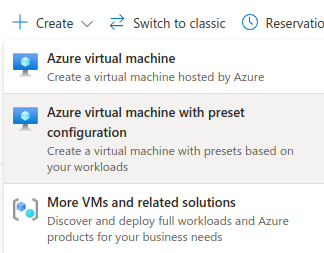

### Criação de VM no Azure: Passo a Passo pelo Portal Web e Azure CLI

A seguir, descrevo os passos detalhados para criar uma máquina virtual (VM) no Azure usando tanto o Portal Web quanto a Azure CLI. Ambas as abordagens fornecem flexibilidade para gerenciar sua IAAS de maneira eficaz.

## Passo a Passo pelo Portal Web

#### 1. Acesse o Portal do Azure 🌐

- Faça login no [portal do Azure](https://portal.azure.com).

#### 2. Crie uma Nova Máquina Virtual ➕

- No painel de navegação, clique em **"Máquinas Virtuais"**.
- Clique em **"Criar"** e selecione **"Máquina Virtual"**.



#### 3. Preencha os Detalhes Básicos 📝

- **Nome da VM**: Digite um nome descritivo para a VM.
- **Região**: Escolha a região onde a VM será hospedada (por exemplo, East US).
- **Opções de Disponibilidade**: Selecione **Conjunto de Disponibilidade** ou **Zona de Disponibilidade** para garantir alta disponibilidade.
- **Imagem**: Escolha o sistema operacional (ex.: Ubuntu Server 22.04 LTS).
- **Tamanho**: Selecione o tamanho da VM conforme suas necessidades de CPU e RAM.
- **Conta de administrador**: Configure o nome de usuário e a senha ou a chave SSH para login.


#### 4. Configure as Opções de Rede 🌐

- **Rede Virtual**: Selecione uma rede virtual existente ou crie uma nova.
- **Sub-rede**: Escolha ou crie uma sub-rede.
- **Grupo de Segurança de Rede (NSG)**: Configure ou selecione um NSG existente para definir as regras de firewall.

.PNG)

#### 5. Configure o Armazenamento e os Discos 💾

- **Disco do Sistema Operacional**: Selecione o tipo de disco (SSD Premium, HDD Standard).
- **Discos de Dados**: Adicione discos adicionais, se necessário.

.PNG)

#### 6. Defina as Configurações Avançadas ⚙️

- **Monitoramento e Diagnóstico**: Habilite ou desabilite o monitoramento, backup e diagnósticos.

- **Script de Automação (Opcional)**: Adicione um script para execução na inicialização, se necessário.


#### 7. Revise e Crie 🔍

- Revise todas as configurações.
- Clique em **"Revisar e Criar"**.
- Após a validação, clique em **"Criar"**. A criação pode levar alguns minutos.


#### 8. Conecte-se à Sua VM 🌟

- Para VM Windows: Use Remote Desktop (RDP).
- Para VM Linux: Use SSH.
.PNG)

## Passo a Passo Usando Azure CLI

#### 1. Configure o Azure CLI

Certifique-se de que o Azure CLI está instalado e atualizado. Abra o terminal de comando ou o Azure Cloud Shell.

```bash
az login
```

#### 2. Crie um Grupo de Recursos (se necessário)

```bash
az group create --name MeuGrupoDeRecursos --location eastus
```

#### 3. Crie uma Rede Virtual e Sub-rede

```bash
az network vnet create \
  --name MinhaVNet \
  --resource-group MeuGrupoDeRecursos \
  --subnet-name MinhaSubRede
```

#### 4. Crie um Grupo de Segurança de Rede (NSG)

```bash
az network nsg create \
  --resource-group MeuGrupoDeRecursos \
  --name MeuNSG
```

#### 5. Crie uma Máquina Virtual

```bash
az vm create \
  --resource-group MeuGrupoDeRecursos \
  --name MinhaVM \
  --image UbuntuLTS \
  --size Standard_DS1_v2 \
  --location eastus \
  --vnet-name MinhaVNet \
  --subnet MinhaSubRede \
  --nsg MeuNSG \
  --admin-username adminuser \
  --admin-password MinhaSenhaSegura!
```

#### 6. Configure Redundância e Alta Disponibilidade

Para adicionar a VM a um Conjunto de Disponibilidade:

```bash
az vm availability-set create \
  --name MeuAvailabilitySet \
  --resource-group MeuGrupoDeRecursos \
  --location eastus
```

Para colocar a VM em uma Zona de Disponibilidade:

```bash
az vm create \
  --resource-group MeuGrupoDeRecursos \
  --name MinhaVM \
  --image UbuntuLTS \
  --size Standard_DS1_v2 \
  --location eastus \
  --zone 1 \
  --vnet-name MinhaVNet \
  --subnet MinhaSubRede \
  --nsg MeuNSG \
  --admin-username adminuser \
  --admin-password MinhaSenhaSegura!
```

#### 7. Verifique a Configuração da VM

```bash
az vm show --name MinhaVM --resource-group MeuGrupoDeRecursos
```

#### 8. Conecte-se à VM 🌟

Para VMs Linux, use SSH:

```bash
ssh adminuser@<IP-Publico>
```

Para VMs Windows, use o Remote Desktop (RDP):

```bash
xfreerdp /v:<IP> /u:<username> /p:<passwd>
```

#### 9. Configure o Monitoramento e Backup 🔍

Monitore a VM e configure alertas de desempenho usando o **Azure Monitor** e o **Log Analytics**.

---
